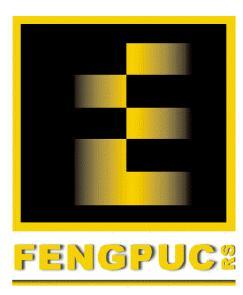

# ABOUT US
Empresa focada em criar soluções através do Engineering Design Process. Fundada em 2017 pelos alunos da PUCRS [Luis Felipe Moura da Silva](https://www.linkedin.com/in/luis-felipe-s-54a804103/), aluno do quinto semestre de Engenharia de Controle e Automação e [Bruno Batista Valentini](https://www.linkedin.com/in/bruno-valentini-b60a10149/), aluno do sétimo semestre de Engenharia Mecânica. Esses alunos foram selecionados pela FENG para estudar no Oshman Engineering Design Kitchen na RICE UNIVERSITY (Houston - EUA) onde foram imersos no Engineering Design process e adquiriram experiência ao utilizá-lo para desenvolvimento de projetos práticos.  

## MEMBERS
- Luis
- Bruno

### PROJECTS
1. _dibetic foot checker_
2. _wheel chair transfer_

`CODEE`

**Bold** and _Italic_ and `Code` text

## CONTACT
**MAIL:** edpbprojects@gmail.com

